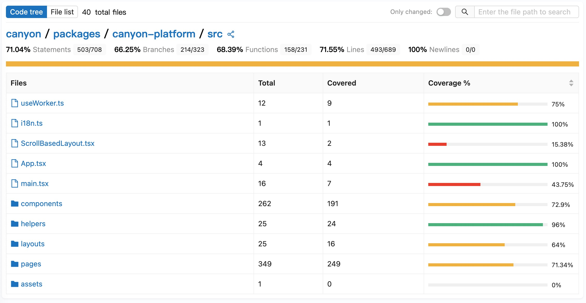

# Canyon     

[English](./README.md) · 中文

👋 Canyon 是一个 JavaScript 代码覆盖率解决方案

视频演示

[Bilibili](https://www.bilibili.com/video/BV13sXHYDEn6)
[YouTube](https://www.youtube.com/watch?v=-2IRQ_pmEjI)

## 生态系统

| 项目                      | 状态                                                         | 描述                                               |
|---------------------------|--------------------------------------------------------------|----------------------------------------------------|
| [babel-plugin-canyon]      | [![babel-plugin-canyon-status]][babel-plugin-canyon-package]  | 在流水线中检测环境变量                             |
| [canyon-uploader]          | [![canyon-uploader-status]][canyon-uploader-package]          | 覆盖率数据上传工具                                 |
| [canyon-extension]         | [![canyon-extension-status]][canyon-extension-package]        | Chrome 插件，用于手动测试的覆盖率报告              |

[babel-plugin-canyon]: https://github.com/canyon-project/canyon/tree/main/plugins/babel-plugin-canyon
[vite-plugin-canyon]: https://github.com/canyon-project/canyon/tree/main/plugins/vite-plugin-canyon
[swc-plugin-canyon]: https://github.com/canyon-project/canyon/tree/main/plugins/swc-plugin-canyon
[canyon-report]: https://github.com/canyon-project/canyon/tree/main/packages/canyon-report
[canyon-sdk]: https://github.com/canyon-project/canyon/tree/main/tools/canyon-sdk
[canyon-uploader]: https://github.com/canyon-project/canyon/tree/main/tools/canyon-uploader
[canyon-extension]: https://github.com/canyon-project/canyon/tree/main/tools/canyon-extension

[babel-plugin-canyon-status]: https://img.shields.io/npm/v/babel-plugin-canyon.svg
[vite-plugin-canyon-status]: https://img.shields.io/npm/v/vite-plugin-canyon.svg
[swc-plugin-canyon-status]: https://img.shields.io/npm/v/swc-plugin-canyon.svg
[canyon-report-status]: https://img.shields.io/npm/v/canyon-report.svg
[canyon-sdk-status]: https://img.shields.io/npm/v/canyon-sdk.svg
[canyon-uploader-status]: https://img.shields.io/npm/v/canyon-uploader.svg
[canyon-extension-status]: https://img.shields.io/chrome-web-store/v/omnpafdjidgpdmlimbangcjjaaodbeof.svg

[babel-plugin-canyon-package]: https://npmjs.com/package/babel-plugin-canyon
[vite-plugin-canyon-package]: https://npmjs.com/package/babel-plugin-canyon
[swc-plugin-canyon-package]: https://npmjs.com/package/babel-plugin-canyon
[canyon-report-package]: https://github.com/canyon-project/uploader/releases
[canyon-sdk-package]: https://github.com/canyon-project/uploader/releases
[canyon-uploader-package]: https://github.com/canyon-project/uploader/releases
[canyon-extension-package]: https://chrome.google.com/webstore/detail/canyon/omnpafdjidgpdmlimbangcjjaaodbeof

## 项目结构

Canyon（意为 “峡谷”，发音 /ˈkænjən/） 是一个 JavaScript 代码覆盖率收集平台。我们解决了开发人员和 QA 工程师在端到端测试过程中收集测试用例代码覆盖率时遇到的困难。它主要由以下三个部分组成：

- 一系列插件，负责适配各种 CI 工具和读取环境变量。

- 一个 API 服务，负责收集和处理覆盖率数据。

- 一套前端和后端服务，负责展示覆盖率报告。

[阅读文档了解更多](https://docs.canyonjs.io)

## 架构

## 微信群

## 开发

按照我们的 [自托管文档](https://docs.canyonjs.io/documentation/self-host/community-edition/prerequisites) 来开始设置开发环境。

## 贡献

请使用 [GitHub Flow](https://guides.github.com/introduction/flow) 进行贡献。创建分支，提交代码，并 [打开拉取请求](https://github.com/canyon-project/canyon/compare)。

请阅读 [`CONTRIBUTING`](CONTRIBUTING.md) 了解更多关于我们 [`CODE OF CONDUCT`](CODE_OF_CONDUCT.md) 和提交拉取请求的流程。

## 许可证

本项目采用 [MIT 许可证](https://opensource.org/licenses/MIT) — 详细信息请参阅 [`LICENSE`](LICENSE) 文件。
