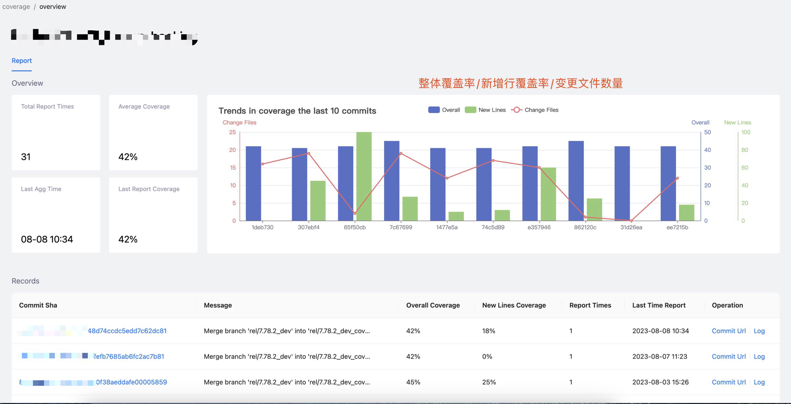
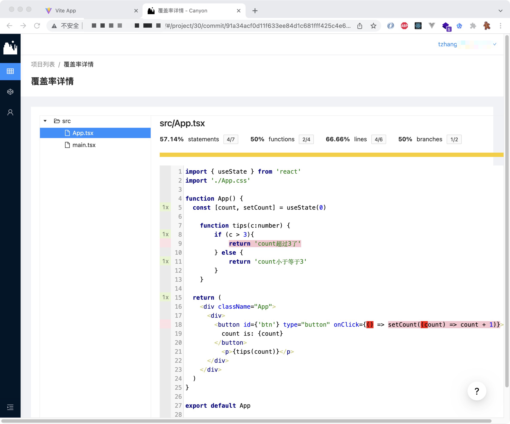
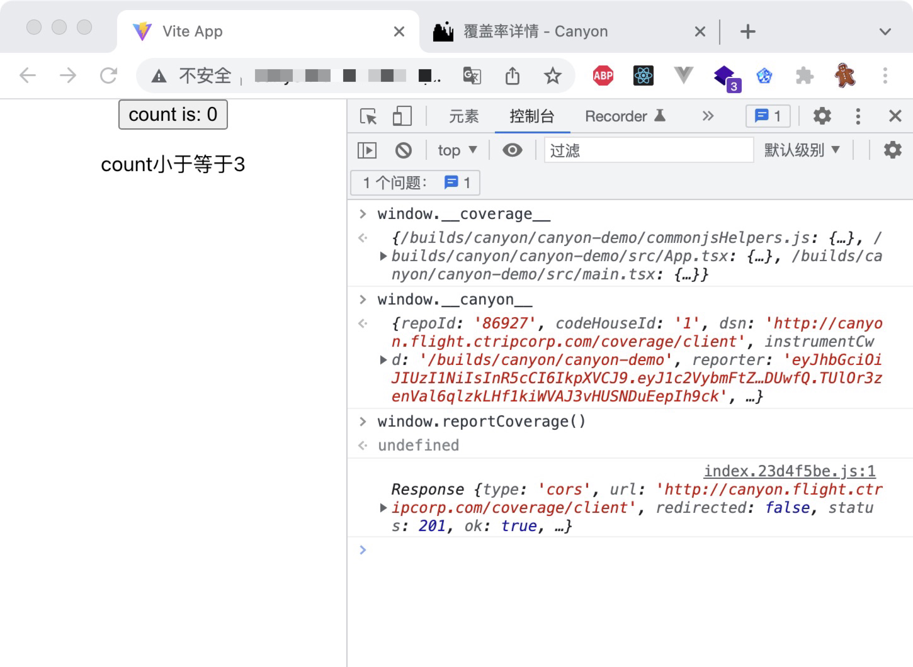
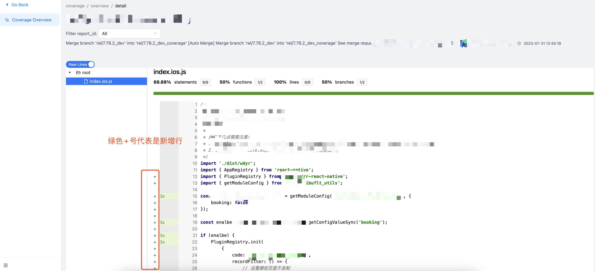
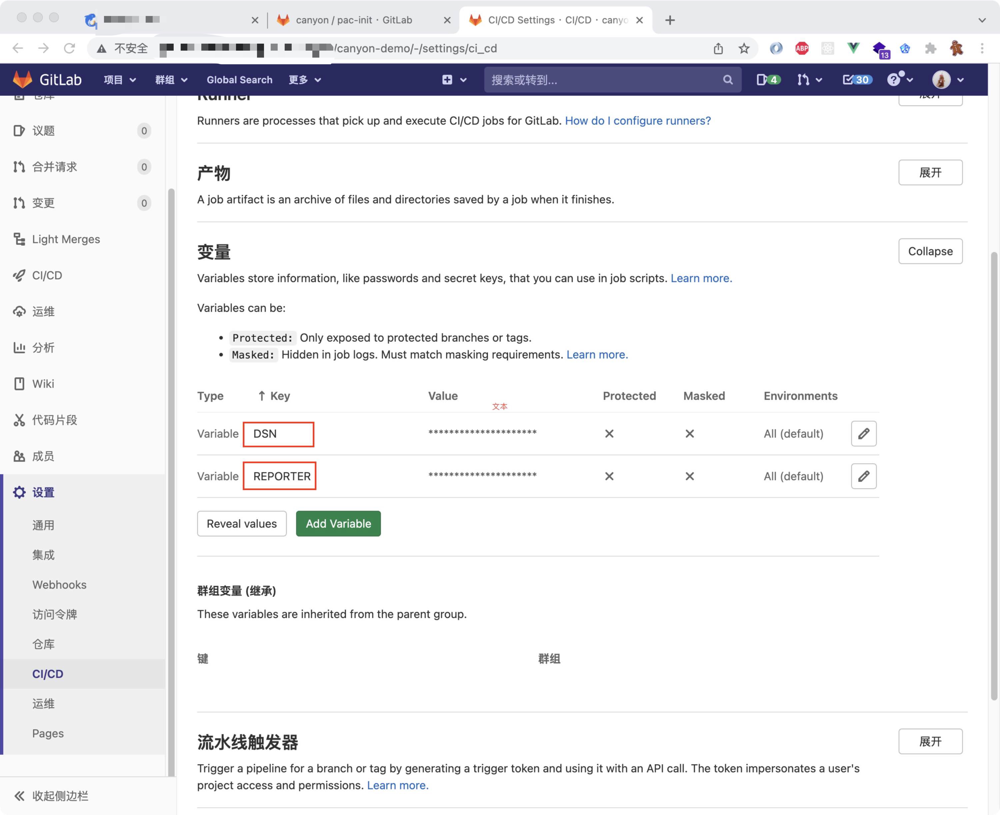

# Canyon  

👋 Canyon is a JavaScript code coverage solution

### **Introduction**

JavaScript 代码覆盖率解决方案。在前端工程构建阶段，将代码探针及工程信息插桩进产物中；在前端应用运行时，将内存中的覆盖率数据上报至服务端。支持覆盖率聚合、报告生成、新增行覆盖率。

主要用于端到端的UI测试用例覆盖率数据收集(也支持node或者UT覆盖率上报收集)。

### **Features**

**Bundling:** 多种生态的bundling方案。

- `vite` - vite-plugin-istanbul
- `babel` - babel-plugin-istanbul
- `swc` - swc-coverage-instrument

**React Native:** 支持React Native覆盖率数据收集。

**File:** 支持多种文件类型，例如js、jsx、ts、tsx。

**源码回溯:** 开启sourceMap选项来回溯源码覆盖率信息。

**CI** 提供覆盖率接口，方便CI工具集成。

**变更代码:** 通过配置想要对比的基线Commit Sha或者分支名，过滤筛选出变更代码文件的覆盖率以及计算出整体新增代码行覆盖率。

**Commit:** 使用oauth2登陆与github、gitlab等代码仓库链接，根据Commit Sha拉取代码进行覆盖率详情绘制。

**聚合:** 根据上报的报告ID进行实时聚合覆盖率数据聚合。

**报告组件:** 构建最小原生JavasScript的npm包，提供现代化前端报告水合方案以代替传统istanbul report。

**浏览器插件:** 提供浏览器插件，供开发人员实时检测应用覆盖率详情。

### Screenshots

