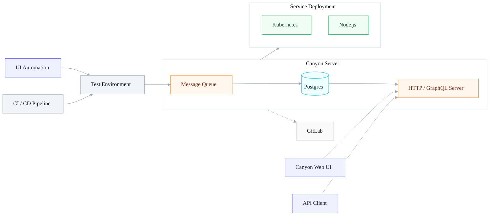

# Canyon     

> [!WARNING]
> The `main` branch is currently in beta testing. For the stable branch, please use [`main-0128`](https://github.com/canyon-project/canyon/tree/main-0128)

👋 Canyon is a JavaScript code coverage solution

Video Showcase

[Bilibili](https://www.bilibili.com/video/BV13sXHYDEn6)
[YouTube](https://www.youtube.com/watch?v=-2IRQ_pmEjI)

## Ecosystem

| Project               | Status                                                       | Description                                        |
|-----------------------|--------------------------------------------------------------|----------------------------------------------------|
| [babel-plugin-canyon] | [![babel-plugin-canyon-status]][babel-plugin-canyon-package] | Detecting environment variables in the pipeline    |
| [canyon-uploader]     | [![canyon-uploader-status]][canyon-uploader-package]         | Coverage data uploader                             |
| [canyon-extension]    | [![canyon-extension-status]][canyon-extension-package]       | Chrome plugin for coverage reporting of manual tests |

[babel-plugin-canyon]: https://github.com/canyon-project/canyon/tree/main/plugins/babel-plugin-canyon
[vite-plugin-canyon]: https://github.com/canyon-project/canyon/tree/main/plugins/vite-plugin-canyon
[swc-plugin-canyon]: https://github.com/canyon-project/canyon/tree/main/plugins/swc-plugin-canyon
[canyon-report]: https://github.com/canyon-project/canyon/tree/main/packages/canyon-report
[canyon-sdk]: https://github.com/canyon-project/canyon/tree/main/tools/canyon-sdk
[canyon-uploader]: https://github.com/canyon-project/canyon/tree/main/tools/canyon-uploader
[canyon-extension]: https://github.com/canyon-project/canyon/tree/main/tools/canyon-extension

[babel-plugin-canyon-status]: https://img.shields.io/npm/v/babel-plugin-canyon.svg
[vite-plugin-canyon-status]: https://img.shields.io/npm/v/vite-plugin-canyon.svg
[swc-plugin-canyon-status]: https://img.shields.io/npm/v/swc-plugin-canyon.svg
[canyon-report-status]: https://img.shields.io/npm/v/canyon-report.svg
[canyon-sdk-status]: https://img.shields.io/npm/v/canyon-sdk.svg
[canyon-uploader-status]: https://img.shields.io/npm/v/canyon-uploader.svg
[canyon-extension-status]: https://img.shields.io/chrome-web-store/v/omnpafdjidgpdmlimbangcjjaaodbeof.svg

[babel-plugin-canyon-package]: https://npmjs.com/package/babel-plugin-canyon
[vite-plugin-canyon-package]: https://npmjs.com/package/babel-plugin-canyon
[swc-plugin-canyon-package]: https://npmjs.com/package/babel-plugin-canyon
[canyon-report-package]: https://github.com/canyon-project/uploader/releases
[canyon-sdk-package]: https://github.com/canyon-project/uploader/releases
[canyon-uploader-package]: https://github.com/canyon-project/uploader/releases
[canyon-extension-package]: https://chrome.google.com/webstore/detail/canyon/omnpafdjidgpdmlimbangcjjaaodbeof

## Project Structure

Canyon (pronounced /ˈkænjən/) is a JavaScript code coverage collection platform. We address the difficulties developers and QA engineers encounter in collecting test case code coverage during end-to-end testing. It consists of three main parts:

- A series of plugin responsible for adapting to various CI tools and reading environment variables.

- An API service responsible for collecting and processing coverage data.

- A set of front-end and back-end services responsible for displaying coverage reports.

[Read the Docs to Learn More.](https://docs.canyonjs.io)

## Architecture

## WeChat Group

## Developing

Follow our [self-hosting documentation](https://docs.canyonjs.io/cn/docs/self-host/community-edition/prerequisites) to get started with the development environment.

## Contributing

Please contribute using [GitHub Flow](https://guides.github.com/introduction/flow). Create a branch, add commits, and [open a pull request](https://github.com/canyon-project/canyon/compare).

Please read [`CONTRIBUTING`](CONTRIBUTING.md) for details on our [`CODE OF CONDUCT`](CODE_OF_CONDUCT.md), and the process for submitting pull requests to us.

## License

This project is licensed under the [MIT License](https://opensource.org/licenses/MIT) — see the [`LICENSE`](LICENSE) file for details.
