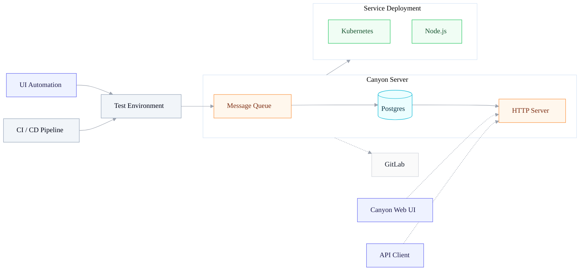

# Canyon     

## Introduction

### Overview

Canyon is a **JavaScript code coverage collection platform**. It tackles the problems developers and QA engineers face when they need **per–test-case** coverage during **end-to-end (E2E) and UI automation** runs.

It is made up of three main parts:

- A set of [**plugins**](https://github.com/canyon-project/canyon/tree/main/plugins) that integrate with common CI setups and read environment variables.
- A [**full-stack application**](https://github.com/canyon-project/canyon/tree/main/app) (**Node.js + React**) that ingests and processes coverage data, exposes backend APIs, and renders coverage reports in the browser.

### Why Canyon?

Canyon **splits hit data and map data at compile time**, so it can handle the **large volumes** of coverage produced by UI automation **efficiently**.

It also **integrates with common CI providers**: instrumentation is injected at **build** time, and coverage can be **collected and reported** while UI automation runs.

That way teams can see **accurate**, near–**real-time** coverage **per test case** in UI automation, and use it to judge and improve code quality.

### Features

- **[Accurate and efficient](https://docs.canyonjs.io/docs/core-concepts/separate-hit-and-map)** — separate hit and map; initial coverage data is produced at compile time for reliable, efficient collection.
- **[Source maps](https://docs.canyonjs.io/docs/core-concepts/restore-source-code-coverage)** — map coverage back to real source code.
- **[Build tooling](https://docs.canyonjs.io/docs/installation/getting-started)** — coverage flows for stacks such as Next.js, Vite, and Webpack.
- **[Automation frameworks](https://docs.canyonjs.io/docs/end-to-end-testing/getting-started)** — integration patterns for common UI automation stacks.
- **[CI providers](https://docs.canyonjs.io/docs/reference/provider)** — GitHub Actions, GitLab CI, and similar runners; CI env detection where applicable.

### Self-hosting

If you want **full control** over coverage and test metadata, you can **[self-host Canyon](https://docs.canyonjs.io/docs/self-host/community-edition/prerequisites)** on your own infrastructure.

## Ecosystem

| Project | Status | Description |
| ------- | ------ | ----------- |
| [@canyonjs/babel-plugin](https://docs.canyonjs.io/docs/ecosystem/babel-plugin) | [![@canyonjs/babel-plugin-status]][@canyonjs/babel-plugin-package] | Babel plugin that detects pipeline / CI environment variables |
| [@canyonjs/cli](https://docs.canyonjs.io/docs/ecosystem/cli) | [![@canyonjs/cli-status]][@canyonjs/cli-package] | Scans local `.canyon_output` and uploads coverage to the server |
| [@canyonjs/collect](https://docs.canyonjs.io/docs/ecosystem/collect) | [![@canyonjs/collect-status]][@canyonjs/collect-package] | Browser-side script package for collecting coverage from web apps |

[@canyonjs/babel-plugin-status]: https://img.shields.io/npm/v/@canyonjs/babel-plugin.svg
[@canyonjs/cli-status]: https://img.shields.io/npm/v/@canyonjs/cli.svg
[@canyonjs/collect-status]: https://img.shields.io/npm/v/@canyonjs/collect.svg
[@canyonjs/babel-plugin-package]: https://www.npmjs.com/package/@canyonjs/babel-plugin
[@canyonjs/cli-package]: https://www.npmjs.com/package/@canyonjs/cli
[@canyonjs/collect-package]: https://www.npmjs.com/package/@canyonjs/collect

## Architecture

High-level flow:

1. A Babel (or compatible) plugin instruments code in your **CI/CD** pipeline.
2. The app is deployed to a **test** environment; **UI automation** or **manual** testing runs the instrumented code.
3. Coverage **hits** are reported to the **Canyon server**.
4. The server stores and processes data, and together with **SCM** source metadata (e.g. GitLab) builds **coverage reports**.

```mermaid
%%{init: {
  "theme": "base",
  "themeVariables": {
    "primaryColor": "#FFF7ED",
    "primaryBorderColor": "#FB923C",
    "lineColor": "#9CA3AF",
    "fontFamily": "Inter, system-ui"
  }
}}%%

flowchart LR
  classDef client fill:#EEF2FF,stroke:#6366F1,color:#1E1B4B;
  classDef test fill:#F1F5F9,stroke:#94A3B8,color:#020617;
  classDef core fill:#FFF7ED,stroke:#FB923C,color:#7C2D12;
  classDef storage fill:#ECFEFF,stroke:#06B6D4,color:#083344;
  classDef infra fill:#F0FDF4,stroke:#22C55E,color:#14532D;
  classDef external fill:#FAFAFA,stroke:#D1D5DB,color:#111827;

  %% Clients
  UI[UI Automation]
  WebUI[Canyon Web UI]
  API[API Client]

  class UI,WebUI,API client

  %% Test
  Test[Test Environment]
  Pipeline[CI / CD Pipeline]

  class Test,Pipeline test

  UI --> Test
  Pipeline --> Test

  %% Canyon Core
  subgraph Canyon["Canyon Server"]
    MQ[Message Queue]
    DB[(Postgres)]
    HTTP[HTTP Server]
  end

  class MQ,HTTP core
  class DB storage

  Test --> MQ
  MQ --> DB
  DB --> HTTP

  %% Infra
  subgraph Deploy["Service Deployment"]
    K8s[Kubernetes]
    Node[Node.js]
  end

  class K8s,Node infra

  Canyon --> Deploy

  %% External
  GitLab[GitLab]
  class GitLab external

  Canyon -.-> GitLab

  WebUI -.-> HTTP
  API -.-> HTTP

```

## WeChat Group

## Contributing

Please contribute using [GitHub Flow](https://guides.github.com/introduction/flow). Create a branch, add commits, and [open a pull request](https://github.com/canyon-project/canyon/compare).

Please read [`CONTRIBUTING`](CONTRIBUTING.md) for details on our [`CODE OF CONDUCT`](CODE_OF_CONDUCT.md), and the process for submitting pull requests to us.

## License

This project is licensed under the [MIT License](https://opensource.org/licenses/MIT) — see the [`LICENSE`](LICENSE) file for details.
