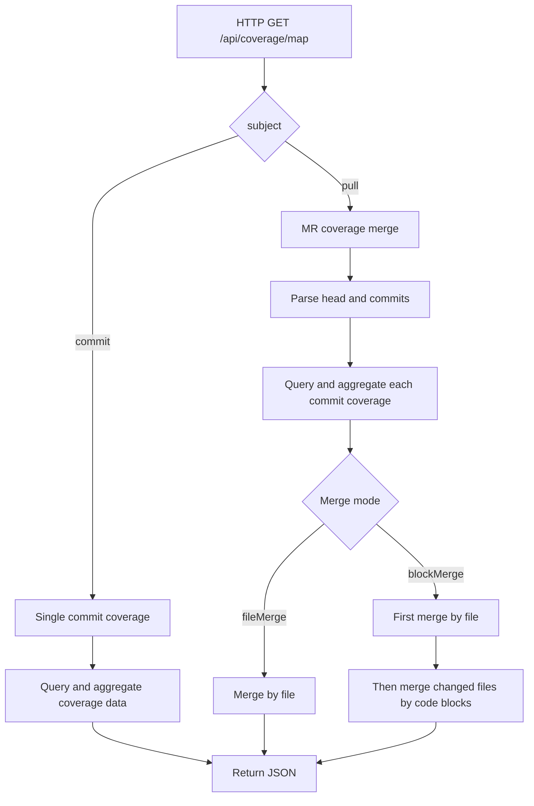

# Merge Code Coverage Across Different Commits

Currently, most projects' end-to-end testing is still primarily manual, with low UI automation usage. In this case, a Merge Request typically contains multiple commits, with each commit corresponding to one test coverage data.

Canyon's current coverage data is aggregated by Commit, which cannot fully reflect the test coverage situation of the entire MR. To reduce regression testing workload and improve testing efficiency, we want to support aggregating coverage data by Merge Request ID.

> [!IMPORTANT]
>
> When using the merge feature, the following issues may occur:
> 1. The minimum dimension for merging is statement blocks.
> 2. When a statement in a.ts is covered in commit1, but its usage is deleted in commit2, and the final version still restores a.ts, the actual coverage of that statement is 0. However, if merged here, it would be 100%.

## Quick Overview

- **MR-level aggregation**: Use head commit as baseline, aggregate coverage from multiple commits.
- **fileMerge**: File-level merge; accumulate counts for unchanged files.
- **blockMerge**: First perform file-level merge, **then merge changed files by code blocks**.
- **Practice recommendation**: Use **fileMerge** by default; use **blockMerge** when you need block-level hits for changed files.

## Solutions

### File Merge

- **fileMerge**: Use MR's head commit as baseline, merge coverage data from all commits
  - For unchanged files, directly accumulate hit counts
  - For changed files, keep baseline file's coverage data unchanged (**no block-level merge**)

### Code Block Merge

- **blockMerge**: Use MR's head commit as baseline, merge coverage data from all commits (first merge by file, then merge changed files by statement code blocks)
  - For unchanged files, directly accumulate hit counts
  - For changed files, perform block-level merge:
    - Baseline file's statement code blocks remain unchanged
    - Blocks in other commits that have the same position as baseline statement code blocks, if hit, accumulate counts
    - If there are multiple identical code blocks during merging, do not merge

### Selection Guide

- **Default**: Prefer `fileMerge`, simple and low risk.
- **Fine-grained statistics**: Choose `blockMerge` to perform block-level merge processing on changed files.

## Process

