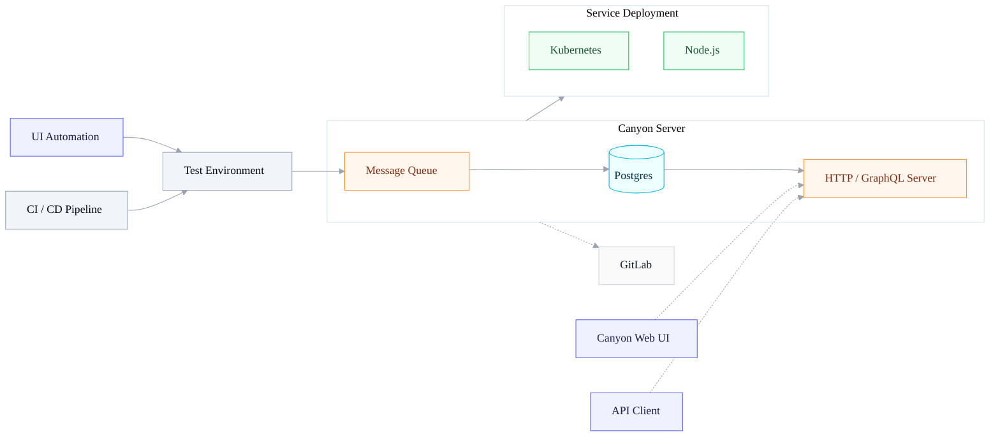

# 介绍

## 概述

Canyon（意为“峡谷”，发音 /ˈkænjən/）是一个 JavaScript 代码覆盖率收集平台。我们解决了开发人员和 QA 工程师在端到端测试期间收集测试用例代码覆盖率时遇到的困难。它由三个主要组件组成：

- 一系列[插件](https://github.com/canyon-project/canyon/tree/main/plugins)，负责适配各种 CI 提供商并检测环境变量。

- 一个[Node.js 服务](https://github.com/canyon-project/canyon/tree/main/packages/canyon-backend)，负责收集和处理覆盖率数据，提供后端 API。

- 一个[React 前端应用](https://github.com/canyon-project/canyon/tree/main/packages/canyon-platform)，负责显示覆盖率数据。

## 为什么选择 Canyon？

Canyon 通过在编译阶段分离 hit 和 map 数据，高效处理 UI 自动化测试生成的大量覆盖率数据。

此外，Canyon 适配常见的 CI 提供商，能够在构建阶段插入探针代码，并在 UI 自动化测试期间收集和报告覆盖率数据。

这使开发团队能够__准确地__、__实时地__了解当前 UI 自动化测试中__每个测试用例__的覆盖情况，从而更好地评估和提高代码质量。

### 特性

- [准确高效](/docs/core-concepts/separate-hit-and-map)：通过分离 hit 和 map，在编译时生成初始覆盖率数据，准确高效地收集覆盖率信息
- [SourceMap](/docs/core-concepts/restore-source-code-coverage)：准确还原源代码覆盖率
- [构建工具](/docs/installation/getting-started)：为 Next.js、Vite、Webpack 等常用构建工具提供覆盖率解决方案
- [自动化框架](/docs/end-to-end-testing/getting-started)：为常见 UI 自动化框架提供集成方案
- [CI 提供商](/docs/reference/provider)：适配 GitHub Actions、GitLab Runner 等常见 CI 提供商，自动检测 CI 环境变量

### 自托管

如果您想完全控制自己的覆盖率数据和测试数据，可以在自己的基础设施上[自托管](/docs/self-host/community-edition/prerequisites) Canyon。

## 生态系统

| 项目                  | 状态                                                         | 描述                                         |
| --------------------- | ------------------------------------------------------------ | -------------------------------------------- |
| [@canyonjs/babel-plugin] | [![@canyonjs/babel-plugin-status]][@canyonjs/babel-plugin-package] | 用于检测流水线环境变量的 Babel 插件           |
| [tools-cli]     | [![tools-cli-status]][tools-cli-package]         | 扫描本地 `.canyon_output` 数据并上传到服务器 |
| [tools-collect]     | [![tools-collect-status]][tools-collect-package]         | 用于网站自动收集覆盖率数据的脚本包 |
| [canyon-extension]    | [![canyon-extension-status]][canyon-extension-package]       | 用于手动报告覆盖率数据的 Chrome 扩展          |

[@canyonjs/babel-plugin]: /docs/ecosystem/babel-plugin
[vite-plugin-canyon]: https://github.com/canyon-project/vite-plugin-canyon
[tools-cli]: /docs/ecosystem/tools-cli
[tools-collect]: /docs/ecosystem/tools-collect
[canyon-extension]: /docs/ecosystem/canyon-extension
[@canyonjs/babel-plugin-status]: https://img.shields.io/npm/v/@canyonjs/babel-plugin.svg
[vite-plugin-canyon-status]: https://img.shields.io/npm/v/vite-plugin-canyon.svg
[tools-cli-status]: https://img.shields.io/github/v/release/canyon-project/canyon
[tools-collect-status]: https://img.shields.io/npm/v/@canyonjs/collect.svg
[canyon-extension-status]: https://img.shields.io/chrome-web-store/v/omnpafdjidgpdmlimbangcjjaaodbeof.svg
[@canyonjs/babel-plugin-package]: https://npmjs.com/package/@canyonjs/babel-plugin
[vite-plugin-canyon-package]: https://npmjs.com/package/babel-plugin-vite
[tools-cli-package]: https://github.com/canyon-project/canyon/releases
[tools-collect-package]: https://npmjs.com/package/@canyonjs/collect
[canyon-extension-package]: https://chrome.google.com/webstore/detail/canyon/omnpafdjidgpdmlimbangcjjaaodbeof

## 架构

下图显示了 Canyon 及其生态系统的一些组件的架构：

1. Babel 插件在 CI/CD 流水线中完成代码插桩。
2. 项目部署到测试环境，用户可以选择 UI 自动化或手动测试来触发插桩代码探针。
3. 生成的覆盖率数据报告到 Canyon 服务器。
4. Canyon 服务器消费数据，并结合 GitLab 提供的源代码信息生成覆盖率报告。

