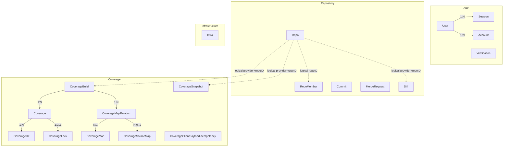
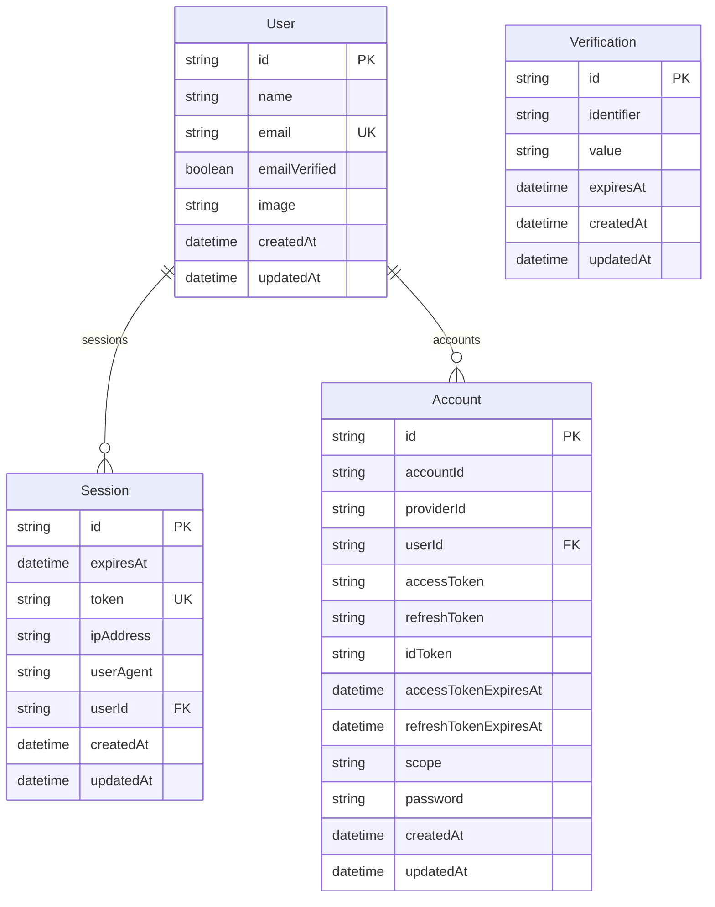
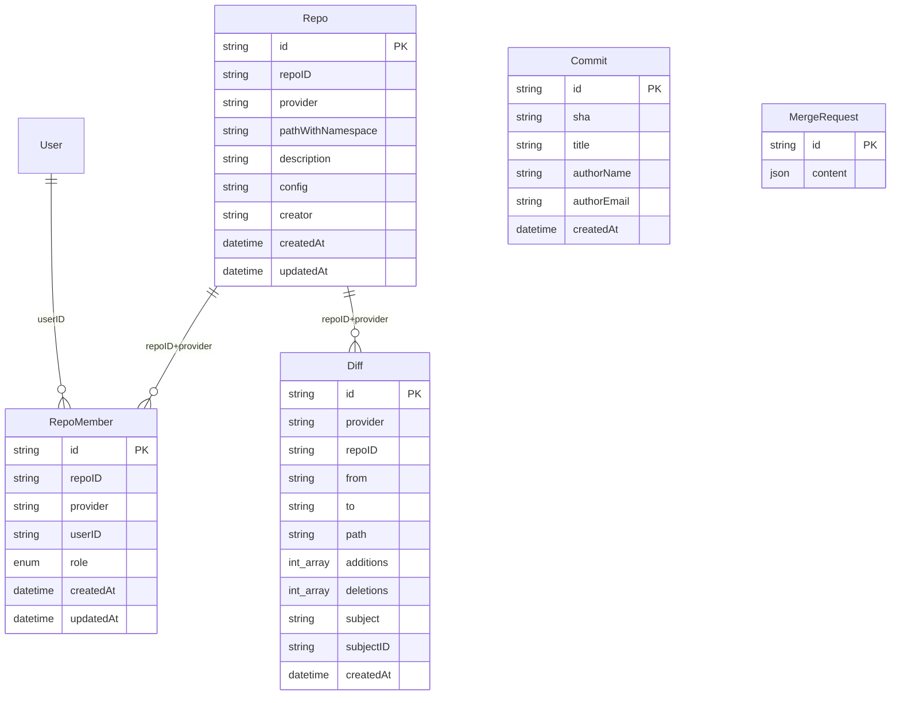
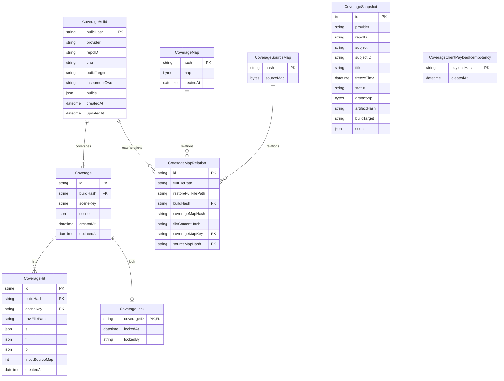
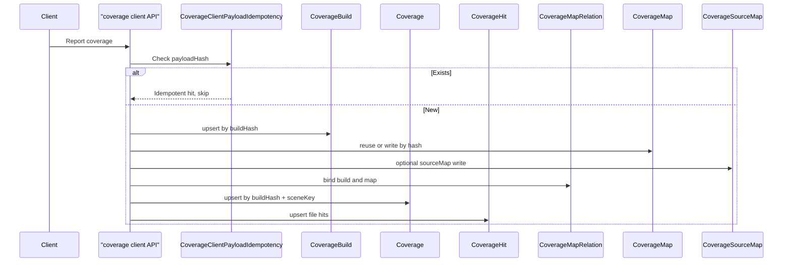
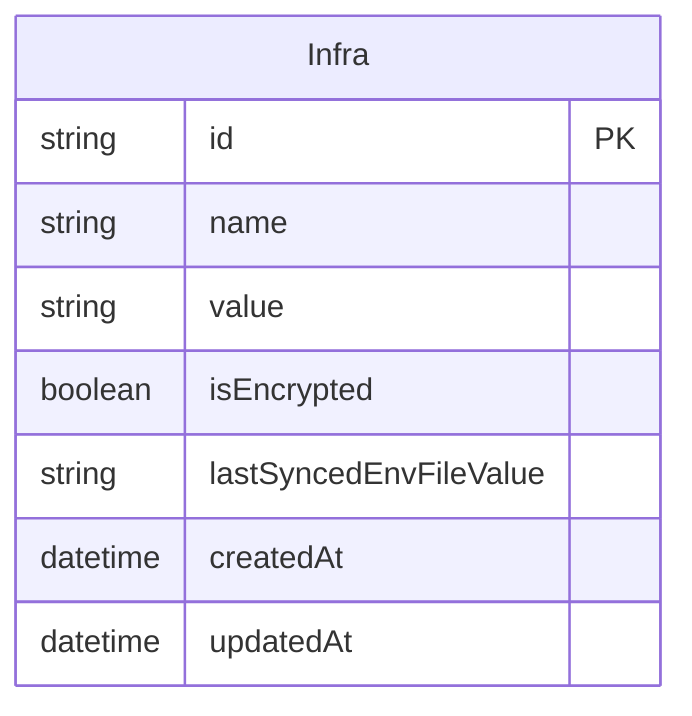

# Data Relations

PostgreSQL data model derived from `schema.prisma`. Grouped by domain, with Prisma foreign keys and logical associations called out separately.

## Overview

> Solid lines: Prisma `@relation` foreign keys. Dashed lines: field-level conventions without Prisma relations.

---

## Auth

Models generated by Better Auth (`User` / `Session` / `Account` / `Verification`). Do not edit manually.

| Model | Table | Notes |
| --- | --- | --- |
| `User` | `canyon_next_user` | User; unique `email` |
| `Session` | `canyon_next_session` | Session; `onDelete: Cascade` |
| `Account` | `canyon_next_account` | OAuth / password; `onDelete: Cascade` |
| `Verification` | `canyon_next_verification` | Verification tokens; no FK |

---

## Repository

Repo, members, commits, PR/MR, and Diff are linked by `provider + repoID` (or related fields). Most have no Prisma `@relation`.

| Model | Table | Notes |
| --- | --- | --- |
| `Repo` | `canyon_next_repo` | Repository metadata and config |
| `RepoMember` | `canyon_next_repo_member` | Members; `@@unique([repoID, userID, provider])`; roles `admin` / `developer` |
| `Commit` | `canyon_next_commit` | Commit info |
| `MergeRequest` | `canyon_next_merge_request` | GitHub PR / GitLab MR; JSON `content` |
| `Diff` | `canyon_next_diff` | File-level diff; `subject` + `subjectID` point to PR/MR |

---

## Coverage

Core chain: `CoverageBuild` → `Coverage` (by scene) → `CoverageHit`. Map relations / maps / source maps are shared per build.

### Relations

| Relation | Cardinality | On delete | Notes |
| --- | --- | --- | --- |
| `CoverageBuild` → `Coverage` | 1:N | Cascade | PK=`buildHash`; Coverage.id = `buildHash\|sceneKey` |
| `CoverageBuild` → `CoverageMapRelation` | 1:N | Cascade | MapRelation shared per build |
| `Coverage` → `CoverageHit` | 1:N | Cascade | Composite FK `[buildHash, sceneKey]` |
| `Coverage` → `CoverageLock` | 1:0..1 | Cascade | Lock by `coverageID` |
| `CoverageMapRelation` → `CoverageMap` | N:1 | — | `coverageMapKey` = `coverageMapHash\|fileContentHash` |
| `CoverageMapRelation` → `CoverageSourceMap` | N:0..1 | — | `sourceMapHash` is null when missing |

### sceneKey

`sceneKey = hash(source + type + env + trigger …)`:

- **source**: `automation` / `manual` / `replay`
- **type**: `e2e` / `unit` / `integration`
- **env**: `test` / `staging` / `prod`
- **trigger**: `pipeline` / `schedule` / `manual`

### Standalone models

| Model | Table | Notes |
| --- | --- | --- |
| `CoverageSnapshot` | `canyon_next_coverage_snapshot` | Frozen snapshot/artifacts; `artifactHash` is unrelated to `CoverageBuild.buildHash`; logical link via `provider + repoID` |
| `CoverageClientPayloadIdempotency` | `canyon_next_coverage_client_payload_idempotency` | Idempotency for `POST /api/coverage/client` payload hashes |

---

## Coverage write path

---

## Infrastructure

| Model | Table | Notes |
| --- | --- | --- |
| `Infra` | `canyon_next_infra_config` | Infra config; `value` may be encrypted |

---

## Table index

| Prisma Model | PostgreSQL Table |
| --- | --- |
| `User` | `canyon_next_user` |
| `Session` | `canyon_next_session` |
| `Account` | `canyon_next_account` |
| `Verification` | `canyon_next_verification` |
| `Repo` | `canyon_next_repo` |
| `RepoMember` | `canyon_next_repo_member` |
| `Commit` | `canyon_next_commit` |
| `MergeRequest` | `canyon_next_merge_request` |
| `Diff` | `canyon_next_diff` |
| `Infra` | `canyon_next_infra_config` |
| `CoverageBuild` | `canyon_next_coverage_build` |
| `Coverage` | `canyon_next_coverage` |
| `CoverageMapRelation` | `canyon_next_coverage_map_relation` |
| `CoverageMap` | `canyon_next_coverage_map` |
| `CoverageSourceMap` | `canyon_next_coverage_source_map` |
| `CoverageHit` | `canyon_next_coverage_hit` |
| `CoverageClientPayloadIdempotency` | `canyon_next_coverage_client_payload_idempotency` |
| `CoverageLock` | `canyon_next_coverage_lock` |
| `CoverageSnapshot` | `canyon_next_coverage_snapshot` |
