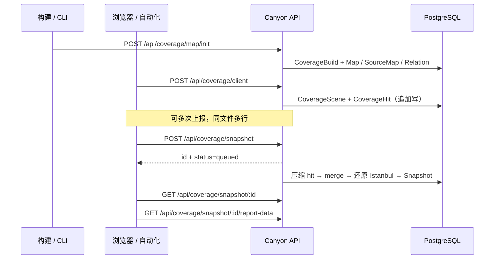

# 覆盖率 API

服务默认：`http://localhost:8080`。路由挂载在 `/api`。

相关代码：

- 采集：`api/src/routes/collect.ts`
- 快照：`api/src/routes/coverage.ts`
- 聚合还原：`api/src/lib/coverage-snapshot.ts`
- Schema：`api/prisma/schema.prisma`

表名前缀：`canyonjs_next5_*`。

---

## 数据流概览



---

## POST `/api/coverage/map/init`

初始化构建级覆盖率映射：**写 build + map，不写 hit**。

### 请求体

```json
{
  "sha": "40位commit sha",
  "provider": "github",
  "repoID": "owner/repo",
  "instrumentCwd": "/path/to/cwd",
  "buildTarget": "",
  "coverage": {
    "/abs/path/file.ts": {
      "path": "/abs/path/file.ts",
      "statementMap": {},
      "fnMap": {},
      "branchMap": {},
      "s": {},
      "f": {},
      "b": {},
      "contentHash": "可选",
      "inputSourceMap": {}
    }
  }
}
```

说明：

- `sha` / `provider` / `repoID` / `instrumentCwd` 必填；也可写在 `coverage` 首条 entry 上。  
- 空字符串 `""` 会回退到 entry 上的字段（使用 `||`，不是 `??`）。  
- `buildHash = sha1(stableStringify({ sha, provider, repoID, instrumentCwd, buildTarget }))`。

### 成功响应

```json
{
  "success": true,
  "message": "Coverage map initialized",
  "data": {
    "buildHash": "...",
    "sceneKey": "...",
    "provider": "github",
    "repoID": "owner/repo",
    "sha": "...",
    "buildTarget": "",
    "instrumentCwd": "...",
    "mapCount": 10,
    "sourceMapCount": 2
  }
}
```

---

## POST `/api/coverage/client`

上报运行时 hit：**追加写入** `CoverageHit`，不做热路径合并。

### 请求体

推荐（与 `@canyonjs/collect` 一致）：

```json
{
  "coverage": {
    "/abs/path/file.ts": {
      "path": "/abs/path/file.ts",
      "s": { "0": 1 },
      "f": {},
      "b": {},
      "buildHash": "..."
    }
  },
  "scene": {
    "source": "automation",
    "type": "e2e",
    "env": "test"
  }
}
```

也兼容裸 coverage map（无 `coverage` / `scene` 包装）。

### 行为

1. 过滤无 `buildHash`、以及 `s` 全 0 的文件。  
2. 校验 `CoverageBuild` 已存在，否则 `502`。  
3. 先插入幂等表（全量 body hash）；冲突则返回 `idempotent: true`。  
4. 确保 `CoverageScene`，`createMany` 写入 hit（`id = payloadHash|rawFilePath`）。

### 成功响应（节选）

```json
{
  "success": true,
  "buildHash": "...",
  "sceneKey": "...",
  "coverageLength": 12,
  "provider": "github",
  "repoID": "owner/repo",
  "sha": "...",
  "instrumentCwd": "..."
}
```

---

## POST `/api/coverage/snapshot`

创建异步快照任务，**立即返回**，不含 Istanbul 正文。

### 请求体

```json
{
  "buildHash": "...",
  "scene": { "type": "e2e", "env": "test" }
}
```

- `buildHash` 必填。  
- `scene`：过滤条件；字段需与已有 `CoverageScene.scene` 相等才匹配。  
- `scene: {}` 或不传：匹配该 build 下全部 scene。

### 任务状态

| status | 含义 |
| --- | --- |
| `queued` | 排队中，**不计** 5 分钟超时 |
| `generating` | 真正开始执行，开始计时 |
| `completed` | 成功 |
| `failed` | 失败 |
| `timeout` | 执行超过 5 分钟 |

进程内串行：前一个任务未完成时，新任务保持 `queued`。

### 后台步骤

1. 选出匹配 scene 的 hit（`createdAt <=` 开始时刻）。  
2. 按 `sceneKey + rawFilePath` 聚合，写回 hit（`id=agg|...`），删除旧行。  
3. 跨 sceneKey 按文件再 merge。  
4. 结合 `CoverageMap` / `CoverageSourceMap` 还原 Istanbul（当前不做 canyon-map remap）。  
5. 用 GitLab `repoID` + `sha` 拉代码 zip 解压，结合源码生成 Istanbul HTML 到 `api/public/snapshots/{id}/`。  
6. 写入 `CoverageSnapshot`。

环境变量（见 `api/.env.example`）：

- `GITLAB_BASE_URL`
- `GITLAB_PRIVATE_TOKEN`

完成后可通过 `reportUrl`（如 `/snapshots/1/index.html`）直接访问 HTML 报告。

### 响应

```json
{
  "success": true,
  "data": {
    "id": 1,
    "buildHash": "...",
    "scene": {},
    "status": "queued",
    "fileCount": 0,
    "hitCount": 0,
    "createdAt": "...",
    "finishedAt": null
  }
}
```

---

## GET `/api/coverage/snapshot/:id`

轮询任务状态（**不含** `istanbul`）。`id` 为正整数。

```json
{
  "success": true,
  "data": {
    "id": 1,
    "buildHash": "...",
    "scene": {},
    "status": "completed",
    "fileCount": 20,
    "hitCount": 20,
    "createdAt": "...",
    "finishedAt": "..."
  }
}
```

---

## GET `/api/coverage/snapshot/:id/report-data`

获取还原后的 Istanbul.js 结构（仅 `status=completed`）。

- 未完成：`409`  
- 不存在：`404`

```json
{
  "type": "istanbuljs",
  "version": "1.0.0",
  "id": 1,
  "buildHash": "...",
  "scene": {},
  "fileCount": 20,
  "hitCount": 20,
  "createdAt": "...",
  "finishedAt": "...",
  "coverage": {
    "/abs/path/file.ts": {
      "path": "/abs/path/file.ts",
      "s": {},
      "f": {},
      "b": {},
      "statementMap": {},
      "fnMap": {},
      "branchMap": {},
      "inputSourceMap": {}
    }
  }
}
```

---

## 表结构摘要

| Model | 表名 | 说明 |
| --- | --- | --- |
| `CoverageBuild` | `canyonjs_next5_coverage_build` | PK=`buildHash` |
| `CoverageScene` | `canyonjs_next5_coverage_scene` | `@@unique([buildHash, sceneKey])` |
| `CoverageHit` | `canyonjs_next5_coverage_hit` | 追加写；无「每文件唯一」约束 |
| `CoverageMapRelation` | `canyonjs_next5_coverage_map_relation` | build ↔ map |
| `CoverageMap` | `canyonjs_next5_coverage_map` | gzip map bytes |
| `CoverageSourceMap` | `canyonjs_next5_coverage_source_map` | gzip sourcemap |
| `CoverageSnapshot` | `canyonjs_next5_coverage_snapshot` | 数字自增 id + istanbul JSON |
| `CoverageClientPayloadIdempotency` | `canyonjs_next5_coverage_client_payload_idempotency` | client 幂等 |

完整 Prisma：`api/prisma/schema.prisma`；SQL：`api/schema.sql`。
