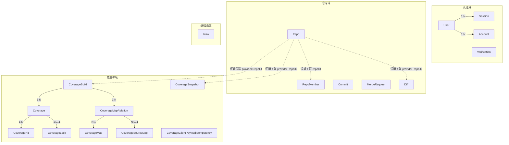
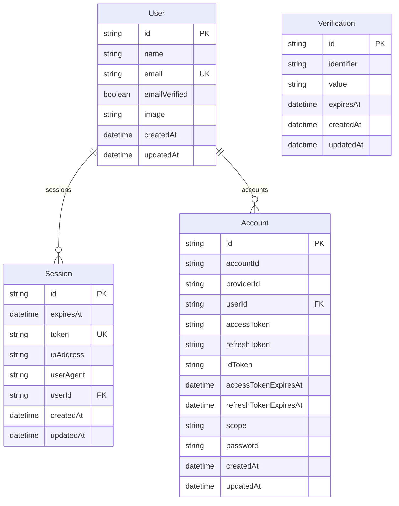
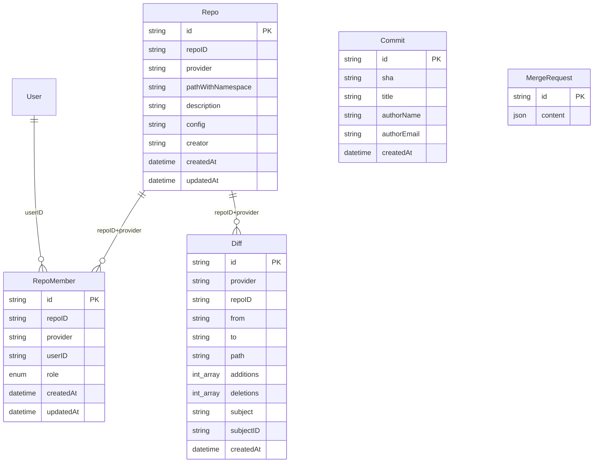
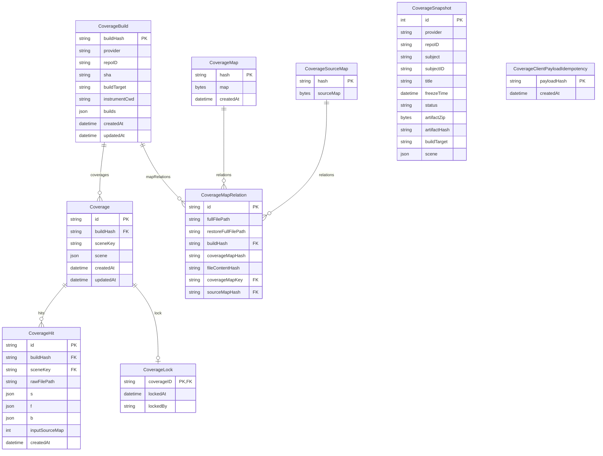
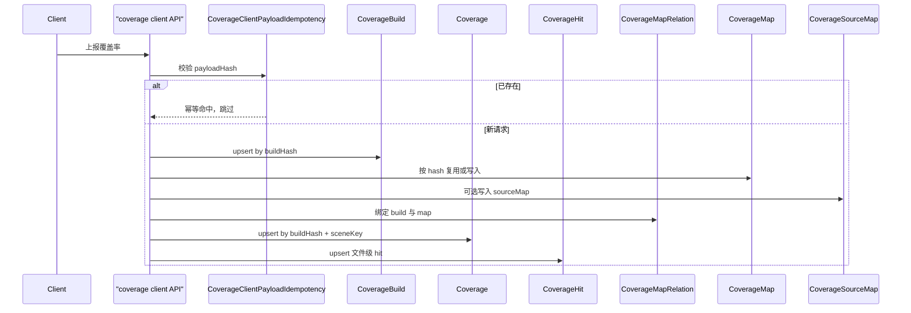
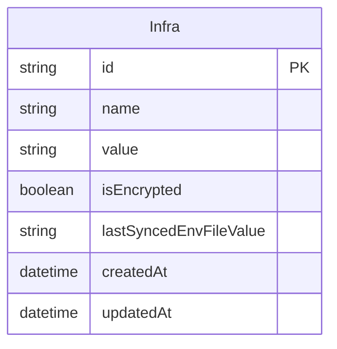

# 数据关系

基于 `schema.prisma` 的 PostgreSQL 数据模型说明。本文档按业务域拆分，并标注 Prisma 显式外键与逻辑关联。

## 总览

> 实线：Prisma `@relation` 外键。虚线：通过字段约定关联，未声明 Prisma relation。

---

## 认证域

Better Auth 生成模型（`User` / `Session` / `Account` / `Verification`），请勿手动修改。

| 模型 | 表名 | 说明 |
| --- | --- | --- |
| `User` | `canyon_next_user` | 用户，`email` 唯一 |
| `Session` | `canyon_next_session` | 登录会话，`onDelete: Cascade` |
| `Account` | `canyon_next_account` | OAuth / 密码账号，`onDelete: Cascade` |
| `Verification` | `canyon_next_verification` | 验证码 / 邮件验证，无外键 |

---

## 仓库域

仓库、成员、提交、PR/MR、Diff 以 `provider + repoID`（或相关字段）逻辑关联，Schema 中多数未声明 Prisma relation。

| 模型 | 表名 | 说明 |
| --- | --- | --- |
| `Repo` | `canyon_next_repo` | 仓库元数据与配置 |
| `RepoMember` | `canyon_next_repo_member` | 仓库成员；`@@unique([repoID, userID, provider])`；角色 `admin` / `developer` |
| `Commit` | `canyon_next_commit` | Commit 信息 |
| `MergeRequest` | `canyon_next_merge_request` | GitHub PR / GitLab MR，`content` 为 JSON |
| `Diff` | `canyon_next_diff` | 文件级 diff；`subject` + `subjectID` 指向 PR/MR 等主体 |

---

## 覆盖率域

核心链路：`CoverageBuild` → `Coverage`（按 scene）→ `CoverageHit`；同一 build 共享 `CoverageMapRelation` / Map / SourceMap。

### 关系说明

| 关系 | 基数 | 删除行为 | 说明 |
| --- | --- | --- | --- |
| `CoverageBuild` → `Coverage` | 1:N | Cascade | PK=`buildHash`；Coverage.id = `buildHash\|sceneKey` |
| `CoverageBuild` → `CoverageMapRelation` | 1:N | Cascade | MapRelation 按 build 共享 |
| `Coverage` → `CoverageHit` | 1:N | Cascade | 复合外键 `[buildHash, sceneKey]` |
| `Coverage` → `CoverageLock` | 1:0..1 | Cascade | 按 `coverageID` 锁定 |
| `CoverageMapRelation` → `CoverageMap` | N:1 | — | `coverageMapKey` = `coverageMapHash\|fileContentHash` |
| `CoverageMapRelation` → `CoverageSourceMap` | N:0..1 | — | 无 sourcemap 时 `sourceMapHash` 为 null |

### sceneKey

`sceneKey = hash(source + type + env + trigger …)`，常见维度：

- **source**: `automation` / `manual` / `replay`
- **type**: `e2e` / `unit` / `integration`
- **env**: `test` / `staging` / `prod`
- **trigger**: `pipeline` / `schedule` / `manual`

### 独立模型

| 模型 | 表名 | 说明 |
| --- | --- | --- |
| `CoverageSnapshot` | `canyon_next_coverage_snapshot` | 冻结快照与产物；`artifactHash` 与 `CoverageBuild.buildHash` 无关；逻辑关联 `provider + repoID` |
| `CoverageClientPayloadIdempotency` | `canyon_next_coverage_client_payload_idempotency` | `POST /api/coverage/client` 全量请求体 hash，幂等去重 |

---

## 覆盖率写入路径

---

## 基础设施

| 模型 | 表名 | 说明 |
| --- | --- | --- |
| `Infra` | `canyon_next_infra_config` | 基础设施配置；`value` 可为加密文本 |

---

## 表名索引

| Prisma Model | PostgreSQL Table |
| --- | --- |
| `User` | `canyon_next_user` |
| `Session` | `canyon_next_session` |
| `Account` | `canyon_next_account` |
| `Verification` | `canyon_next_verification` |
| `Repo` | `canyon_next_repo` |
| `RepoMember` | `canyon_next_repo_member` |
| `Commit` | `canyon_next_commit` |
| `MergeRequest` | `canyon_next_merge_request` |
| `Diff` | `canyon_next_diff` |
| `Infra` | `canyon_next_infra_config` |
| `CoverageBuild` | `canyon_next_coverage_build` |
| `Coverage` | `canyon_next_coverage` |
| `CoverageMapRelation` | `canyon_next_coverage_map_relation` |
| `CoverageMap` | `canyon_next_coverage_map` |
| `CoverageSourceMap` | `canyon_next_coverage_source_map` |
| `CoverageHit` | `canyon_next_coverage_hit` |
| `CoverageClientPayloadIdempotency` | `canyon_next_coverage_client_payload_idempotency` |
| `CoverageLock` | `canyon_next_coverage_lock` |
| `CoverageSnapshot` | `canyon_next_coverage_snapshot` |
