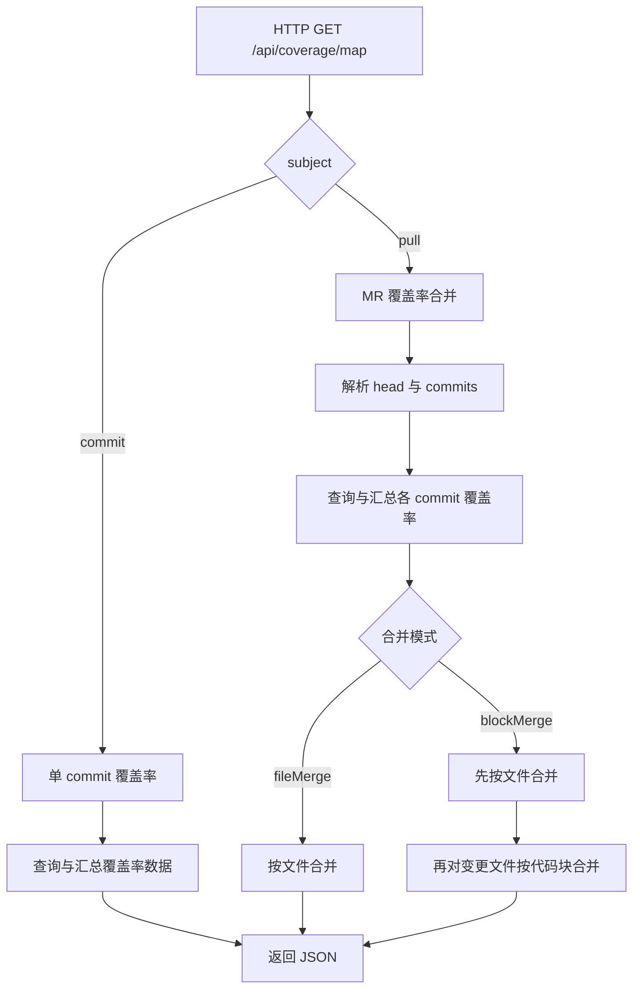

# 回归测试覆盖率合并

## 背景

目前多数项目的端到端测试仍以人工回归为主，UI 自动化使用率较低。在这种情况下，一次 Merge Request 通常包含多个 commit，每个 commit 可能对应一次测试覆盖率数据。

Canyon 当前的覆盖率数据是以 commit 为单位聚合的，无法全面反映整个 MR 的测试覆盖情况。为减轻回归测试工作量，提升测试效率，我们希望支持以 Merge Request ID 为单位聚合覆盖率数据。

> [!IMPORTANT]
>
> 在使用回归测试覆盖率合并功能时，可能会出现以下问题：
> 1. 无法确保一次 MR 中的所有 commit 未变更代码文件的coverageMap完全相同。（对于普通项目概率低，可能出现在构建配置改变）
> 2. 需明白其覆盖率的含义。当a.ts的某个函数文件在commit1中被覆盖率，但是在commit2中删除了该函数的使用，最终版本还是还原了a.ts，实际该函数的覆盖率是0。但是这里如果要合并的话会是100%。

## 方案

### 文件合并

- **fileMerge**：以 MR 的 head commit 为基线，合并所有 commit 的覆盖率数据
  - 对于未变更的文件，直接累加命中计数
  - 对于变更的文件，保持基线文件的覆盖率数据不变（不进行块级合并）

### 代码块合并

- **blockMerge**：以 MR 的 head commit 为基线，合并所有 commit 的覆盖率数据
  - 对于未变更的文件，直接累加命中计数
  - 对于变更的文件，进行块级合并：
    - 基线文件的代码块保持不变
    - 其他 commit 中与基线代码块位置相同的块，若有命中则累加计数

## 流程

