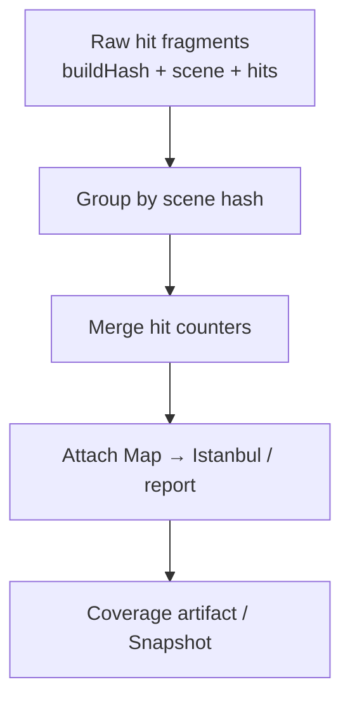

# Scene Hash Aggregation

When generating coverage artifacts, Canyon first **aggregates records that share the same scene hash**.

## Goals

- **Shrink volume** by merging hits under the same scene
- **Reduce cardinality** of work items for report generation
- **Speed up later runs** by reusing aggregated intermediates

## Flow

## How it fits Hit/Map separation

1. CI: maps stored once, keyed by `buildHash`
2. Collection: many lightweight hits arrive tagged by scene
3. Generation: aggregate by scene hash, then join maps

Static structure is stored once; dynamic hits can be bulk-merged — which is what makes UI-automation scale feasible.

## Practical tips

- Keep scene keys stable and enumerable (`suite` + `caseId`)
- Retries of the same case collapse under the same scene hash
- Use `buildHash` / commit as the version boundary when comparing builds
