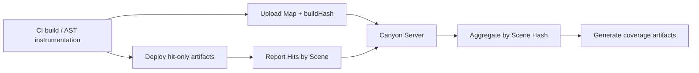

# Architecture

Canyon’s main pipeline has four stages:

## 1. CI: bind Commit and instrument

During CI, the plugin reads the pipeline **commit id** (plus repo / provider metadata) and associates it with the JS being compiled.

Via AST parsing (with Istanbul):

- Emit coverage **maps** (static structure)
- Inject runtime **hit** counters
- Compute **buildHash** as the join key

Business metadata (`repoID`, `sha`, `provider`, …) is written into `.canyon_output` map files rather than bloating the frontend bundle.

## 2. Separate Hit and Map

Browser artifacts keep hits only; full maps are uploaded early in CI. See [Separate Hit and Map](/guide/concepts/separate-hit-and-map).

## 3. Collect: Scene + buildHash

Runtime uploads categorize hits with **scene key/value** pairs. Every payload carries `buildHash` so the server can recover the matching map and source version. See [Scene](/guide/concepts/scene).

## 4. Generate: aggregate then report

Before emitting coverage artifacts, Canyon aggregates records that share the same **scene hash**, shrinking volume and speeding up subsequent generations. See [Scene Hash Aggregation](/guide/concepts/aggregation).

## Data formats

The server accepts **V8** and **Istanbul.js** coverage inputs into the same pipeline. See [Data Formats](/guide/concepts/data-formats).
