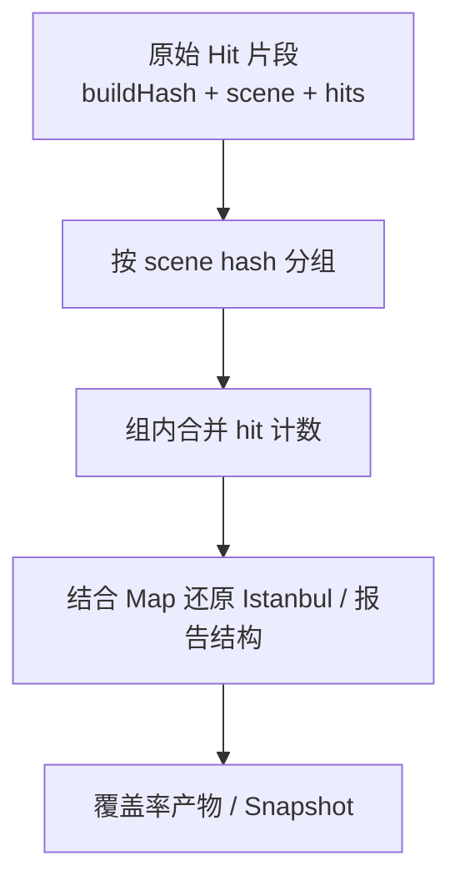

# Scene Hash 聚合

触发生成覆盖率产物时，Canyon 不会直接把海量原始 hit 片段逐条渲染，而是先做 **相同 scene hash 的聚合**。

## 目标

- **体积收敛**：合并重复场景下的 hit，减少参与合成的数据量
- **数量收敛**：降低待处理条目数，缩短报告生成时间
- **加速下次生成**：聚合后的中间态可复用，有利于后续增量 / 重复触发生成

## 流程示意

## 与 Hit/Map 分离的配合

1. CI：map 已提前入库，并绑定 `buildHash`
2. 采集：大量轻量 hit 按 scene 流入
3. 生成：先按 scene hash 聚合 hit，再挂接对应 map

这样「静态结构只存一份、动态命中可批量归并」，整体链路才能支撑 UI 自动化量级的数据。

## 实践建议

- Scene 标签尽量稳定、可枚举（如 `suite` + `caseId`），避免无意义的高基数 key
- 同一 case 多次重试时，相同 scene hash 会被聚合，避免重复膨胀
- 需要对比不同构建时，仍以 `buildHash`（及 commit）为版本边界
