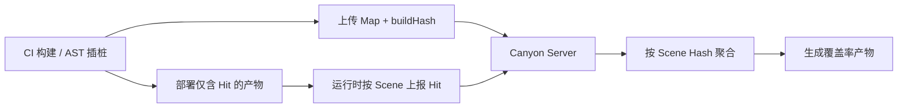

# 整体架构

Canyon 的主线可以概括为四步：

## 1. CI：绑定 Commit 并插桩

在 CI 阶段，插件读取当前流水线的 **commit id**（以及 repo / provider 等），与即将编译的 JS 源码建立关联。

通过 AST 解析（配合 Istanbul）：

- 生成覆盖率所需的 **map**（静态结构）
- 生成运行时 **hit** 计数插桩
- 计算 **buildHash**，作为后续关联主键

业务元数据（`repoID`、`sha`、`provider` 等）写入 `.canyon_output` 的初始覆盖率文件，而不是全部打进前端产物。

## 2. 分离 Hit 与 Map

插桩后的浏览器产物默认只保留 hit；完整 map 在 CI 中提前上传。这样运行时传输量可下降一个数量级以上。详见 [分离 Hit 与 Map](/guide/concepts/separate-hit-and-map)。

## 3. 采集：Scene + buildHash

运行时按 **scene key/value** 分门别类地上报各 case 的 hit。每条数据都带 `buildHash`，服务端据此找回对应构建的 map 与源码版本。详见 [Scene 分场景](/guide/concepts/scene)。

## 4. 生成：先聚合再出报告

触发生成覆盖率产物时，先对相同 **scene hash** 的数据做聚合，让总体积与条数收敛，再合成 Istanbul / 报告所需结构。这有助于提升下一次生成速度。详见 [Scene Hash 聚合](/guide/concepts/aggregation)。

## 数据格式

服务端可接受 **V8** 与 **Istanbul.js** 类型的覆盖率输入，统一纳入上述链路。详见 [数据格式](/guide/concepts/data-formats)。
